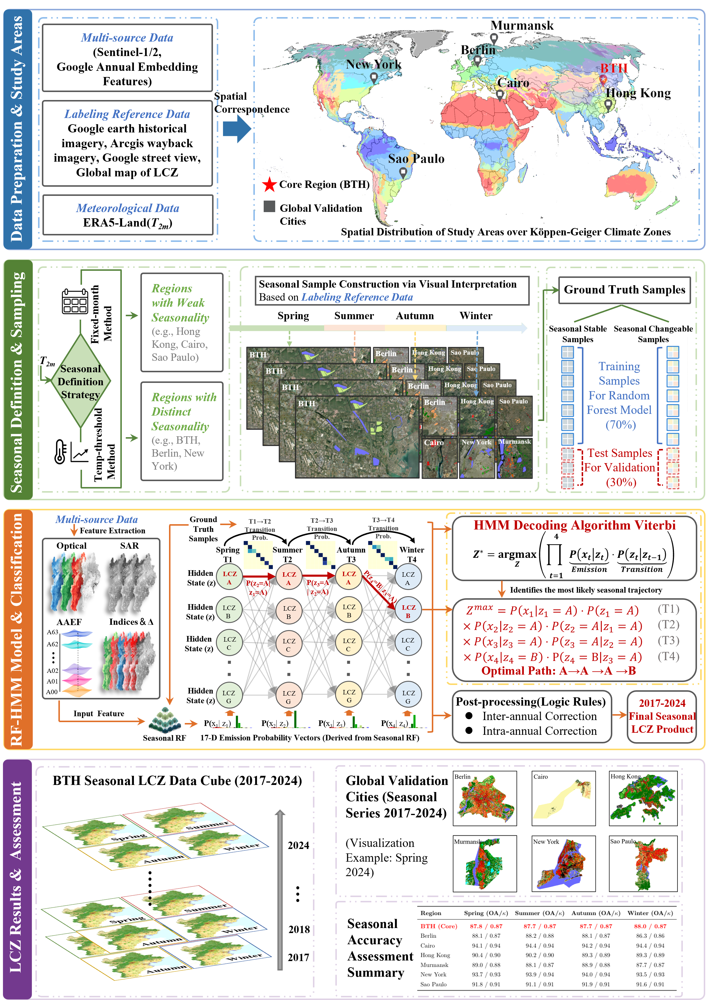
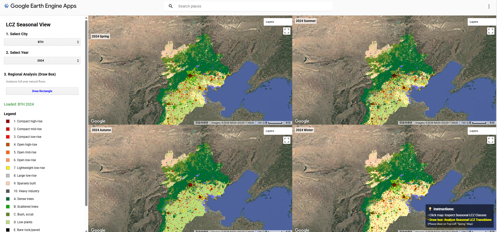

# Seasonally Consistent Local Climate Zone Mapping via Annual AlphaEarth Embedding Features and Hidden Markov Modeling

This repository contains the data and code accompanying the research: **Seasonally Consistent Local Climate Zone Mapping via Annual AlphaEarth Embedding Features and Hidden Markov Modeling**.

## Methodology Overview
The framework integrates:

1.  **Climate-Adaptive Seasonal Definition Strategy**: Guided by Köppen climate classification, this study establishes specific seasonal definition strategies. A **temperature-threshold method** ($10^{\circ}C/22^{\circ}C$) is adopted for regions with distinct seasonality (e.g., BTH) to align with phenology, while the **Fixed Meteorological Season** standard is applied to regions with weak seasonality to ensure global transferability.
2.  **Multi-Source Feature Engineering with AAEF**: To capture fine-grained phenological dynamics, a robust feature space is constructed. It integrates **Annual AlphaEarth Embedding Features (AAEF)** as a stable semantic backbone, combined with **Sentinel-2 multispectral bands**, **Sentinel-1 SAR** , **seasonal spectral indices** and **Sentinel-1 SAR**. Crucially, **Seasonal-Annual Difference Features ($\Delta F$)** are explicitly introduced to quantify the deviation of seasonal states from the annual average, enhancing sensitivity to phenological changes.
3.  **Coupled RF-HMM Inference Model**: The framework reformulates LCZ mapping as a temporal inference problem. Random Forest (RF) classifiers generate initial seasonal emission probabilities, while a **Hidden Markov Model (HMM)** introduces transition probabilities based on physical laws (e.g., the irreversibility of built-up areas) to decode the optimal seasonal trajectory.
4.  **Spatiotemporal Consistency Refinement**: A hierarchical Two-Stage Temporal Filter is applied to post-process the HMM results, explicitly correcting illogical inter-annual flicke (e.g., "False Demolition") to ensure the final LCZ product is physically self-consistent.



## Data Source
The study utilizes a comprehensive set of multi-source datasets, including high-resolution validation data, meteorological records, and multi-sensor satellite imagery. Detailed specifications are listed below:

### 1. Labeling & Reference Data
Used for ground truth sample construction and visual verification.
* **Google Earth Imagery**: High-resolution (<1 m) RGB visual imagery, sourced from [Google Earth Web](https://earth.google.com).
* **ArcGIS Wayback**: Historical high-resolution (<1 m) RGB imagery archives, sourced from [ArcGIS Living Atlas](https://livingatlas.arcgis.com/wayback).
* **Google Street View**: Panoramic ground-level views for checking vertical urban structures, sourced from [Google Maps](https://maps.google.com).
* **Global Map of Local Climate Zones (GLCZ)**: 100 m resolution LCZ labels used as a comparative benchmark, sourced from [LCZ Generator](https://lcz-generator.rub.de/global-lcz-map).

### 2. Meteorological Data
Used for the climate-adaptive seasonal definition strategy.
* **ERA5-Land**: 11,132 m resolution. Provides 2m Air Temperature ($T_{2m}$) for calculating daily mean temperatures ($T_{5}$), sourced from [Copernicus Climate Data Store](https://cds.climate.copernicus.eu/datasets/derived-era5-land-daily-statistics).     

### 3. Core Remote Sensing Data
Used for feature extraction and model input.
* **Sentinel-2 MSI**: 10 m resolution. Optical bands (B2–B8, B11, B12) for capturing seasonal phenology, [NASA EarthData](https://www.earthdata.nasa.gov/data/instruments/sentinel-2-msi).
* **Sentinel-1 SAR**: 10 m resolution. VV and VH backscatter coefficients for vertical structure information, sourced from [Sentinel Hub](https://docs.sentinel-hub.com/api/latest/data/sentinel-1-grd)
* **Landsat-8 OLI/TIRS**: 30 m resolution. Bands B2–B7 and Thermal Infrared (B10) used for baseline comparison,[USGS](https://www.usgs.gov/core-science-systems/nli/landsat/landsat-collection-2-level-2-science-products).
* **Google Satellite Embedding (V1)**: 10 m resolution. **64-dimensional Annual AlphaEarth Embedding Features (AAEF)** derived from self-supervised learning, serving as the stable background feature, sourced from [GEE Data Catalog](https://developers.google.com/earth-engine/datasets/catalog/GOOGLE_SATELLITE_EMBEDDING_V1_ANNUAL).

### 4. Auxiliary Data
Used to characterize complex urban environments in the incremental feature experiment (F6).
* **SRTM DEM**: 30 m resolution. Elevation data, sourced from [NASA EarthData](https://doi.org/10.5067/MEaSUREs/SRTM/SRTMGL1_NC.003).
* **VIIRS NTL**: 500 m resolution. Average Radiance (Nighttime Lights) reflecting anthropogenic intensity, [Earth Observation Group](https://eogdata.mines.edu/products/vnl/#monthly).
* **WorldPop**: 100 m resolution. Global population count data, sourced from [WorldPop](https://www.worldpop.org).

## Project Structure

```
├── .gitignore          # Git configuration: Specifies intentionally untracked files
├── LICENSE             # Project's software license
├── README.md           # Main documentation: Methodology overview and usage guide
├── requirements.txt    # Python dependencies list 
│
├─ codes/               # Source code for the entire workflow
│  ├─ Data_Reliability_Assessment/
│  │  ├─ analyze_sentinel2_cloud_stats.js       # GEE: Analyzes seasonal cloud cover distribution
│  │  └─ benchmark_manual_vs_glcz_with_aaef.js  # GEE: Cross-validates manual samples against GLCZ product
│  │
│  ├─ HMM_Framework/
│  │  ├─ export_seasonal_transition_and_emission_probs.js # GEE: Calculates Emission & Transition Matrices for HMM
│  │  └─ hmm-correction-lcz_product.js          # GEE: Main HMM inference (Viterbi) and spatiotemporal refinement
│  │
│  ├─ Incremental_Feature_Comparison/           # Feature engineering experiments 
│  │  ├─ exp_F1_optical_baseline.js             # Experiment F1: Baseline using Landsat-8 only
│  │  ├─ exp_F2_add_spectral_indices.js         # Experiment F2: Adding Spectral Indices (NDVI, etc.)
│  │  ├─ exp_F3_add_texture_features.js         # Experiment F3: Adding GLCM Texture features
│  │  ├─ exp_F4_add_sar_features.js             # Experiment F4: Adding Sentinel-1 SAR Backscatter
│  │  ├─ exp_F5_add_sentinel2.js                # Experiment F5: Adding Sentinel-2 multispectral bands
│  │  ├─ exp_F6_add_auxiliary_data.js           # Experiment F6: Adding DEM, Population, and NTL
│  │  └─ exp_F7_aaef_standalone.js              # Experiment F7: AAEF 
│  │
│  └─ Post_Processing_and_Analysis/
│     ├─ eval_final_seasonal_product_accuracy.js # GEE: Assesses final seasonal LCZ mapping accuracy
│     ├─ eval_temporal_stability_flicker.py      # Python: Statistical analysis of temporal flicker reduction
│     ├─ extract_seasonal_transition_matrix.py   # Python: Extracts transition data for visualization
│     └─ seasonal_sankey_diagram.py              # Python: Generates Sankey diagrams for seasonal transitions
│
├─ datas/               # Sample data and model parameters
│  ├─ 2018murmansk.* # Demo Shapefile: Sample training data (Murmansk) for structure demonstration
│  ├─ TransMatrix_Autumn_Winter.csv # Core Parameter: Transition probabilities (Autumn -> Winter)
│  ├─ TransMatrix_Spring_Summer.csv # Core Parameter: Transition probabilities (Spring -> Summer)
│  └─ TransMatrix_Summer_Autumn.csv # Core Parameter: Transition probabilities (Summer -> Autumn)
│
└─ images/              # Visualization assets for documentation
   ├─ flow.png          # Methodological flowchart
   ├─ result1.png       # Visualization of results 
   ├─ result2.png       # Visualization of results 
   └─ result3.png       # Visualization of results 

```

## Step
The workflow is broken down into four main steps, corresponding to the sections in the paper.

### Step 1: Adaptive Seasonal Definition 
* **Platform**: Google Earth Engine (GEE)
* **Code**: [generate_adaptive_seasonal_windows.js](codes/Seasonal_Definition/generate_adaptive_seasonal_windows.js)

We employ a **Climate-Adaptive Seasonal Definition Strategy** to delineate seasons. Based on the Köppen climate classification, a **temperature-threshold method** ($10^{\circ}C$ and $22^{\circ}C$) is applied to regions with distinct seasonality (e.g., BTH, Berlin) to align with phenological rhythms.   Conversely, for regions with weak seasonality (e.g., Hong Kong, Cairo), the **Fixed Meteorological Season** standard is adopted to ensure applicability.

### Step 2: Incremental Feature Evaluation & Final Feature Construction
* **Platform**: Google Earth Engine (GEE)
* **Code**:
    * [exp_F1_optical_baseline.js](codes/Incremental_Feature_Comparison/exp_F1_optical_baseline.js)
    * [exp_F2_add_spectral_indices.js](codes/Incremental_Feature_Comparison/exp_F2_add_spectral_indices.js)
    * [exp_F3_add_texture_features.js](codes/Incremental_Feature_Comparison/exp_F3_add_texture_features.js)
    * [exp_F4_add_sar_features.js](codes/Incremental_Feature_Comparison/exp_F4_add_sar_features.js)
    * [exp_F5_add_sentinel2.js](codes/Incremental_Feature_Comparison/exp_F5_add_sentinel2.js)
    * [exp_F6_add_auxiliary_data.js](codes/Incremental_Feature_Comparison/exp_F6_add_auxiliary_data.js)
    * [exp_F7_aaef_standalone.js](codes/Incremental_Feature_Comparison/exp_F7_aaef_standalone.js)

We first conducted **incremental feature experiments (F1-F7)** to evaluate different feature combinations. Results demonstrated that **F7 (AAEF)** provides the most robust representation. 

Consequently, **F7 is selected as the static background backbone**, which is then integrated with seasonal dynamic features to construct the **final input space for the HMM**:

1.  **Background Feature (F7)**: **AAEF (64-d)**, serving as a spatially continuous semantic reference to resist cloud contamination.
2.  **Seasonal Optical Bands**: Sentinel-2 multispectral bands (B2, B3, B4, B8, B11, B12) to capture direct phenological reflectance.
3.  **Seasonal Spectral Indices**: Includes NDVI, MNDWI, and NDBI to characterize vegetation and impervious surface gradients.
4.  **Seasonal SAR Backscatter**: Sentinel-1 VV/VH data to supplement structural texture information.
5.  **Seasonal-Annual Difference ($\Delta F$)**: Explicitly calculates the deviation of the current season from the annual mean ($F_{S_k} - F_{annual}$), amplifying the signal of phenological variations.


### Step 3: HMM Model Construction
* **Platform**: Google Earth Engine (GEE)
* **Code**: [export_seasonal_transition_and_emission_probs.js](codes/HMM_Framework/export_seasonal_transition_and_emission_probs.js)

We construct the core components of the Hidden Markov Model (HMM). First, Random Forest classifiers are trained for each season to generate **Emission Probabilities** (observation likelihoods). Simultaneously, we calculate **Transition Probability Matrices** based on ground truth statistics. These matrices strictly enforce the physical stability of built-up classes (irreversibility) while allowing natural classes to evolve according to phenological laws (e.g., Vegetation $\to$ Bare Soil in winter).

### Step 4: Spatiotemporal Refinement
* **Platform**: Google Earth Engine (GEE) & Python
* **Code**: [hmm_correction_lcz_product.js](codes/_HMM_Framework/hmm_correction_lcz_product.js)

  The **Hidden Markov Model (HMM)** is applied to decode the optimal seasonal sequence using the Viterbi algorithm.   A subsequent **Two-Stage Temporal Filter** is used to further refine the results:
1.    **Anti-False Demolition**: Corrects "Built $\to$ Nature $\to$ Built" errors.
2.    **Anti-False Expansion**: Corrects "Nature $\to$ Built $\to$ Nature" errors.
3.    **Intra-annual Consistency**: Anchors built-up pixels to ensure they remain stable throughout the year.


## GEE App Link

We have published a public Google Earth Engine (GEE) app that serves as an interactive demonstration of our findings. This tool allows you to visually compare the seasonal LCZ maps and observe the improvements brought by the HMM correction.

**Interactive App**: [Click here to launch the GEE App](https://ee-l2892786691.projects.earthengine.app/view/global-seasonal-lcz-explorer)




